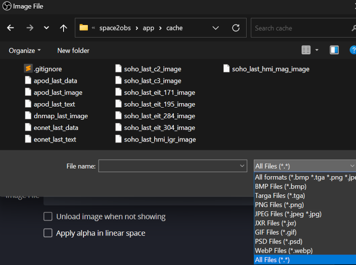

# space2obs

Command-line tools to fetch interesting data (mostly image and text) about our solar system (including our beautiful planet!) and making it available to be displayed in [OBS Studio](https://github.com/obsproject/obs-studio). That's the primary motivation, but you can use the output files however you want of course.

- **apod**: random images with explanations from [Astronomy Picture of the Day](https://apod.nasa.gov)
- **dnmap**: realtime day/night map from [Time and Date AS](https://www.timeanddate.com)
- **eonet**: latest events from [Earth Observatory Natural Event Tracker](https://eonet.gsfc.nasa.gov)
- **soho**: latest images from [SOHO, the Solar & Heliospheric Observatory](https://soho.nascom.nasa.gov)

**Important**: Read through the rules of these services before you use any of the tools.

Demo video on YouTube:
[](https://www.youtube.com/embed/WGMR_rx8r8Q)


## Dependencies

- [Python](https://www.python.org) `>= 3.11.2`
  - [requests](https://requests.readthedocs.io) `>= 2.28.1`

Approximate disk space needed when running tools with defaults:
- apod: 2 MB
- dnmap: 100 KB
- eonet: 150 KB
- soho: 5 MB


## Usage

```bash
# Synopsis
space2obs.py <TOOL> [OPTIONS]
```

- TOOL is required, choices: `apod`, `dnmap`, `eonet`, `soho`
- OPTIONS are optional
- If no OPTIONS are given, their default values will be used
- If both TOOL and OPTIONS are not given, the help will be displayed


## Options

**shared**: These can be used with any of the tools.

- `-h`, `--help`: Display help message and exit.
- `-c PATH`, `--cache-dir PATH`: Specify the directory path where cache files will be stored. Default: `space2obs/app/cache`
- `-s PATH`, `--secrets-file PATH`: Specify the file path where secrets are stored. Default: `space2obs/app/secrets.json`
- `-i SEC`, `--interval SEC`: Set the interval in seconds for the tool to check for new remote data. Default: `300`
- `-r SEC`, `--retry-delay SEC`: Set the delay in seconds before retrying if the situation requires it. Default: `60`
- `-t SEC`, `--request-timeout SEC`: Set the maximum time in seconds for a remote request to complete. Default: `10`

**apod**:
- `--apod-max-explanation-length NUM`: Set the maximum length in characters for the explanation text. Default: `600`
- `--apod-text-template TEXT`: Specify the template for the text file. Add linebreaks with `\n`. Variables: `{title}`, `{explanation}`, `{copyright}`, `{date}`. Default: `{title}\n\n{explanation}\n\n[ {copyright} | apod.nasa.gov | {date} ]`

**dnmap**:
- `--dnmap-simple`: Download the simple version of the map image. Default: *download the satellite version*

**eonet**:
- `--eonet-status TYPE`: The type of entry to fetch. Choices: `all`, `open`, `closed`. Default: `all`
- `--eonet-limit NUM`: Set the maximum number of events to fetch. Default: `50`
- `--eonet-text-template TEXT`: Specify the template of a line in the text file. Add linebreaks with `\n`. Variables: `{date}`, `{id}`, `{categories}`, `{title}`. Default: `{status:>6} {date} {id} {categories}: {title}`

**soho**:
- `--soho-cameras ID [ID ...]`: Specify one or more camera IDs to download images from. Choices: `c2`, `c3`, `eit_171`, `eit_195`, `eit_284`, `eit_304`, `hmi_igr`, `hmi_mag`. Default: `all`


## Examples

```bash
# Display help message:
space2obs.py
space2obs.py -h
space2obs.py --help
```

```bash
# Use shared options with any tool:
space2obs.py apod --cache-dir /tmp/apod/ --secrets-file /tmp/secrets.json
space2obs.py dnmap --cache-dir /tmp/dnmap/ --interval 120
space2obs.py eonet --retry-delay 30
space2obs.py soho --request-timeout 5 --interval 900
space2obs.py apod --cache-dir /tmp/apod/ --secrets-file /tmp/secrets.json --interval 120 --retry-delay 30 --request-timeout 5
```

```bash
# apod:
space2obs.py apod
space2obs.py apod --apod-max-explanation-length 100
space2obs.py apod --apod-text-template '{date}: {title}\n{explanation}'
space2obs.py apod --apod-max-explanation-length 100 --apod-text-template '{date}: {title}\n{explanation}'
```

```bash
# dnmap:
space2obs.py dnmap
space2obs.py dnmap --dnmap-simple
```

```bash
# eonet:
space2obs.py eonet
space2obs.py eonet --eonet-status open
space2obs.py eonet --eonet-limit 10
space2obs.py eonet --eonet-text-template '{status}: {title}'
space2obs.py eonet --eonet-status open --eonet-limit 10 --eonet-text-template '{status}: {title}'
```

```bash
# soho:
space2obs.py soho
space2obs.py soho --soho-cameras all
space2obs.py soho --soho-cameras c2 c3 eit_304
```


## Cache Directory and Secrets File

The **cache directory** and **secrets file** must exist. They won't be created automatically.

By default an empty cache directory is included in the [space2obs release](https://github.com/etrusci-org/space2obs/releases), but in case you are missing it, create it inside the **space2obs/app/** directory, e.g.: `space2obs/app/cache/`.

You can have your cache directory in another location. Just use the `--cache-dir` option to point to the custom location.

The secrets file is currently only needed for **apod**.

1. Copy **space2obs/app/secrets.example.json** to **space2obs/app/secrets.json**.
2. [Register a personal API key](https://api.nasa.gov) and add it to `nasa_api_key` in **secrets.json**.

You can have your secrets file in another location. Just use the `--secrets-file` option to point to the custom location.


## Output Files

***_data** = json files
***_image** = image files
***_text** = text files

- apod_last_data
- apod_last_image
- apod_last_text
- dnmap_last_image
- eonet_last_data
- eonet_last_text
- soho_last_c2_image
- soho_last_c3_image
- soho_last_eit_171_image
- soho_last_eit_195_image
- soho_last_eit_284_image
- soho_last_eit_304_image
- soho_last_hmi_igr_image
- soho_last_hmi_mag_image

**Good to know**: When selecting the files in OBS Studio, you must put the file extension dropdown to "All files" or you won't see the files (because they have no extension):



## License

[The Unlicense](./LICENSE.md)
